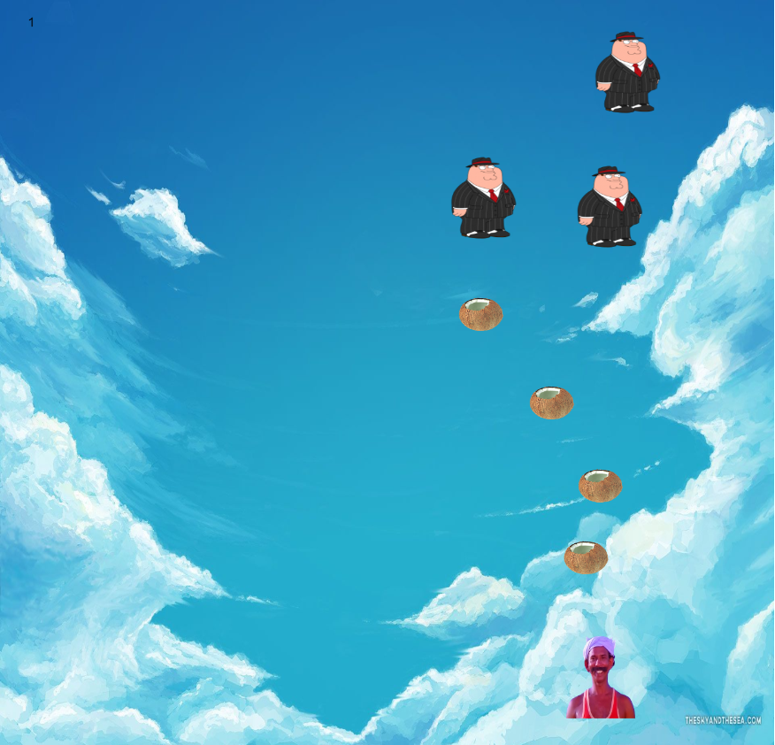

# MalluMemeGame - A Fun Meme Shooting Game



MalluMemeGame is an entertaining shooting game that lets you play as the legendary actor Mamukoya, known for his humorous dialogues and expressions. In this game, you'll shoot coconuts at gangster memes that are invading your territory. It's your chance to show off your meme-shooting skills and bring laughter to the world!

## How to Play

1. Use your mouse to move Mamukoya on the screen.
2. Click on the screen to shoot coconuts at the incoming gangster memes.
3. Your goal is to eliminate the gangster memes and protect your territory.
4. Be careful not to let any gangster meme pass you, or you'll lose the game.
5. Aim for high scores by shooting down as many gangster memes as you can!

## Controls

- **Mouse Movement:** Move Mamukoya left and right.
- **Mouse Click:** Shoot coconuts.

## Game Features

- Fun Meme-Shooting Action: Enjoy shooting coconuts at gangster memes with Mamukoya's style!
- Unlimited Bullets: Shoot as many coconuts as you want. There's no shortage of coconuts!
- Challenging Enemies: Face waves of gangster memes, each more menacing than the last.
- Score Tracking: Keep track of your score and aim for a high score.
- Victory and Loss: Rejoice in victory or accept defeat with humorous messages from Mamukoya.
- Background Music: Listen to Mamukoya's iconic dialogues while playing.

## Getting Started

1. Clone this repository:

```bash
git clone https://github.com/your-username/MalluMemeGame.git
cd MalluMemeGame
```

2. Open the `index.html` file in your web browser.

## Development and Contributions

MalluMemeGame is a fun project, and contributions are welcome! If you find any bugs, have ideas for improvements, or want to add more memes and features, feel free to open an issue or submit a pull request.

## Acknowledgments

This game was inspired by the iconic actor Mamukoya and the creative world of memes.

## License

MalluMemeGame is released under the [MIT License](https://opensource.org/licenses/MIT).

---

**Note:** Customize this README.md file further with additional information, such as credits for image and audio assets used, any third-party libraries or APIs utilized, and any other relevant details about the game and its development.
